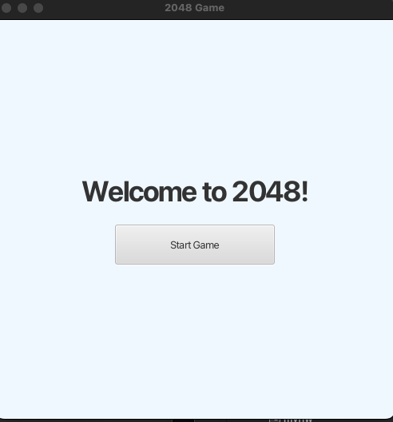
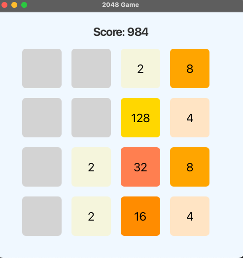

# 2048 Game - JavaFX Version

A clean, simple, and fully functional implementation of the popular 2048 game using JavaFX and following the MVC architecture.


## 🚀 Features

- Full 2048 gameplay: swipe tiles, merge numbers, reach 2048!
- **Home Screen**: welcoming message with Start button.
- **Score tracking** displayed at the top.
- **End-of-game handling**: shows a message when you lose or win.
- **Responsive design**: looks good on different window sizes.
- **Modern look** with soft color theme.

## 🏗️ Technologies Used

- Java 17
- JavaFX 21
- Maven for project management
- FXML for GUI layout (separated View)

## 📂 Project Structure

```
src/
 └── main/
     ├── java/
     │   └── com.example.game2048/
     │       ├── controller/
     │       │   ├── Game2048Controller.java
     │       │   └── HomeScreenController.java
     │       ├── model/
     │       │   ├── Board.java
     │       │   ├── Game2048Model.java
     │       │   └── Tile.java
     │       ├── view/
     │       │   ├── Game2048View.java
     │       │   ├── HelloApplication.java
     │       │   └── TileNode.java
     │       └── Game2048App.java
     ├── resources/
     │   └── com.example.game2048/
     │       ├── Game2048View.fxml
     │       └── HomeScreen.fxml
     └── module-info.java
```

## 🧠 Architecture and Design

This project follows a clean **MVC (Model-View-Controller)** architecture:

- **Model** (`model` package):
  - Manages the game logic (board state, moves, merges, score calculation).
  - Notifies observers when the board changes (using `Observable` pattern).

- **View** (`view` package):
  - Displays the board, tiles, score, and handles basic user interactions.
  - Built with JavaFX and FXML for separation of design and logic.

- **Controller** (`controller` package):
  - Acts as the intermediary between the View and Model.
  - Listens to user inputs and updates the Model accordingly.
  - Listens to Model updates and refreshes the View.

- **Game Flow**:
  1. User presses a key → View notifies Controller.
  2. Controller tells the Model to move/merge tiles.
  3. Model updates its state and notifies observers.
  4. Controller receives notification and updates the View.

Additionally:
- **Observer Pattern** is used for communication between Model → Controller → View.
- **Separation of Concerns** ensures that logic, UI, and user interaction are independent and cleanly managed.

This structure makes the game **easy to maintain, extend, and test**.

## ⚙️ How to Run

1. Clone the repository:
   ```
   git clone https://github.com/NRevivo/2048Game-JavaFx.git
   ```

2. Open the project in **IntelliJ IDEA** or any IDE that supports Maven and JavaFX.

3. Make sure you have **Java 17** installed.

4. Run using Maven:
   ```
   mvn clean javafx:run
   ```

## 📸 Screenshots

### Home Screen


### Gameplay

